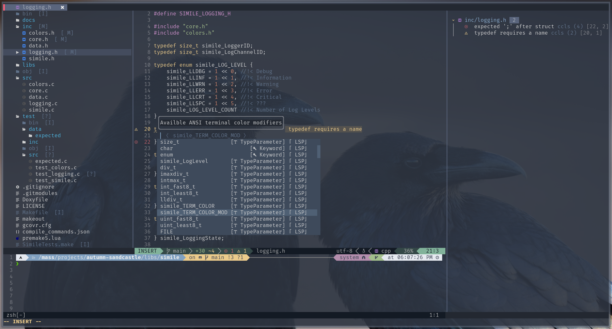

# dotfiles

Silas' Arch Dotfiles

This repository contains configuration files, or *dotfiles* for many programs which I use in my Arch Linux install. I hope to soon migrate all of my configuration to this repository.

## Currently Available Dotfiles

### Program Categories

- [Editors](#editors)
- [Terminal](#terminal)

### Editors

| Name              | Description                    | Project Page(s)                                                                            |
| ----------------- | ------------------------------ | ------------------------------------------------------------------------------------------ |
| [Neovim](#neovim) | Community-driven fork of `vim` | [:globe_with_meridians:](https://neovim.io/) [:octocat:](https://github.com/neovim/neovim) |

#### Neovim

Neovim is a community-driven fork of `vim`, and my primary development environment.

**Note: Terminal opacity and background color is handled by my `kitty` config, and the prompt theme is handled by my `zsh` and `powerlevel10k` config.**

##### Features

- LSP autocompletion/snippets/highlighting for many languages
using [COQ](https://github.com/ms-jpq/coq_nvim) completion engine
- [Greeter](https://github.com/goolord/alpha-nvim)
- Ability to force save read-only files ([Suda](https://github.com/lambdalisue/suda.vim))
- [Advanced TODO comment highlighting and listing](https://github.com/folke/todo-comments.nvim)
- Error/warning minibuffer ([Trouble](https://github.com/folke/trouble.nvim))
- Nordlike color scheme ([NightFox NordFox](https://github.com/EdenEast/nightfox.nvim))
- [Color code highlighting in truecolor](https://github.com/norcalli/nvim-colorizer.lua)
- Word count for markdown and plaintext files
- Tactical&nbsp;Drip
- *Much* more

##### Dependencies

###### Plugin Management
- [Vim-Plug](https://github.com/junegunn/vim-plug)

###### Language Servers (If you don't want any of these, remove the corresponding LSP config lines)
- [CCLS](https://github.com/MaskRay/ccls)
- [Bash Language Server](https://github.com/bash-lsp/bash-language-server)
- [VS Code Language Servers Extracted](https://github.com/hrsh7th/vscode-langservers-extracted)
- [vscode-gradle](https://github.com/microsoft/vscode-gradle)
- [Eclipse JDT Language Server](https://github.com/eclipse/eclipse.jdt.ls)
- [OmniSharp Roslyn](https://github.com/omnisharp/omnisharp-roslyn)
- [Python LSP Server](https://github.com/python-lsp/python-lsp-server)
- [Remark Language Server](https://github.com/remarkjs/remark-language-server)
- [rust-analyzer](https://github.com/rust-lang/rust-analyzer)
- [solargraph](https://solargraph.org/)
- [Lua Language Server](https://github.com/sumneko/lua-language-server)
- [texlab](https://github.com/latex-lsp/texlab)
- [TypeScript Language Server](https://github.com/typescript-language-server/typescript-language-server)
- [Vim Language Server](https://github.com/iamcco/vim-language-server)
- [YAML Language Server](https://github.com/redhat-developer/yaml-language-server)
- [zeta_note](https://github.com/artempyanykh/zeta-note)

###### Other
- [A Patched Nerd Font](https://github.com/ryanoasis/nerd-fonts)

### Terminal

| Name            | Description                                      | Project Page(s)                                                                                             |
| --------------- | ------------------------------------------------ | ----------------------------------------------------------------------------------------------------------- |
| [Kitty](#kitty) | GPU-accelerated and featureful terminal emulator | [:globe_with_meridians:](https://sw.kovidgoyal.net/kitty/) [:octocat:](https://github.com/kovidgoyal/kitty) |

## Coming Soon

- kitty (terminal)
- zsh (shell)
    - powerlevel10k (theme)
- LightDM (Display Manager)
- Awesome Window Manager (WM)
- Picom (Compositor)
